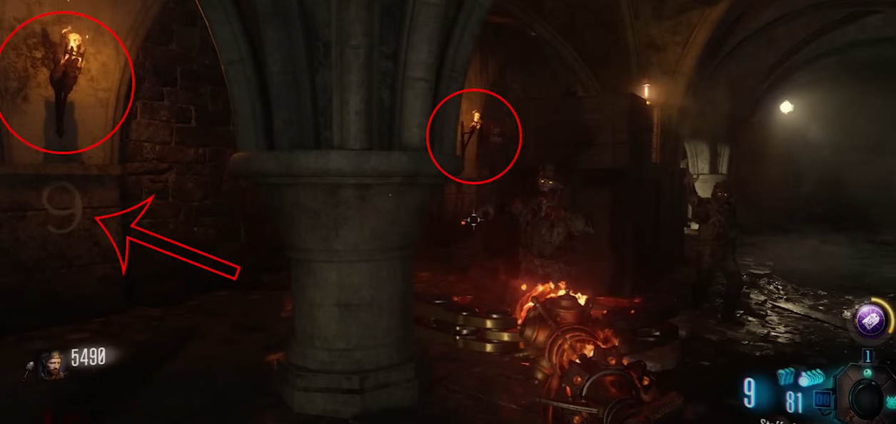
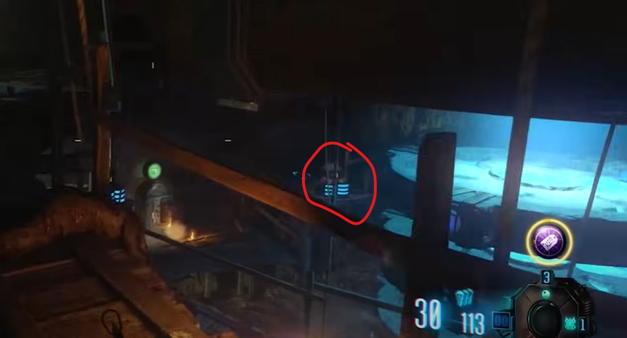

# Fire Staff Build and Upgrade Guide

## Note:
* Need the Gramophone
* Need the black record

## Fire Staff build guide
You can craft the Fire Staff at the bottom of the dig site on the red pedestal.

### Red record locations:
In between where the tank sits and the boxes under the church. You may have to move the tank for this part.\
\
\
On the top floor of the church on some benches near the back.\
\
\
On top of a box at generator six behind the church.\

### Fire gemstone:
Go into the fire tunnel which is in the trenches right outside of spawn. Place down the Gramophone to build the portal and go to the crazy place. The red pedestal is the one containing the fire gemstone.

### Staff parts:
Each part is acquired in a different way. One part is obtained by killing the first panzer that spawns in.\
\
One part is obtained by shooting a glowing plane out of the sky.\
\
\
\
Shooting it will cause the part to fall next to the dig site here:\
\
\
\
The plane will spawn after one round once the door that leads under the church has been purchased.\
\
One part is obtained by turning generator six on behind the church and picking it up out of the chest there.

## Fire Staff upgrade steps

### Step 1:
In the crazy place, at the bottom of the fire area, there are some cauldrons on top of a metal floor.\
\
\
\
Kill zombies with the Fire Staff while they are standing on the metal floor. Progress will be made when the cauldrons start to fill up. Light up all of the cauldrons.

### Step 2:
There will be numerous symbols on the top floor of the church that are on the walls.\
\
\
\
Additionally, there are also torches under the church that have numbers under them.\
\
\
\
Those symbols represent numbers that need to have their corresponding torches lit. There will be four torches that need to be lit.\
\
\
\
Light all four torches in quick succession, there will not be a specific order.

### Step 3:
At the bottom of the mound, rotate the four rings in the center of the room so that they are all red. Use the four levers to rotate them, once they are all red, shoot the red orb twice with the Fire Staff.\
\
\
\
It should fly up into the air if done correctly.

#### Lever locations:
The lever on the stairs heading downwards clockwise rotates the top ring.\
\
\
The lever on the stairs heading downwards counter-clockwise rotates the ring below that.\
\
\
The lever on the wooden platform just above Mule Kick to its left rotates the next ring.\
\
\
The lever on the wooden platform just above Mule Kick to its right rotates the last ring.\

### Step 4:
In the crazy place, place the Fire Staff in the red pedestal. It's the same pedestal that you collected the fire gemstone from. You now must kill around 25 zombies anywhere in the crazy place. You will see their souls leave their bodies. Once you can pick the staff back up it will be upgraded.
