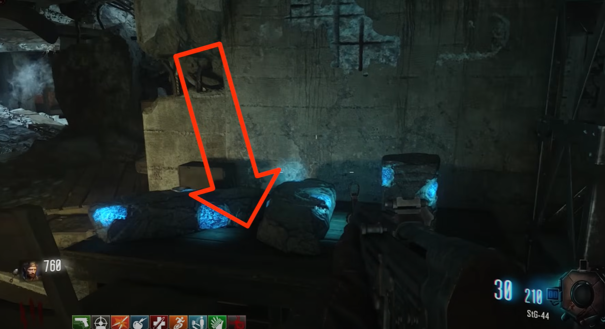
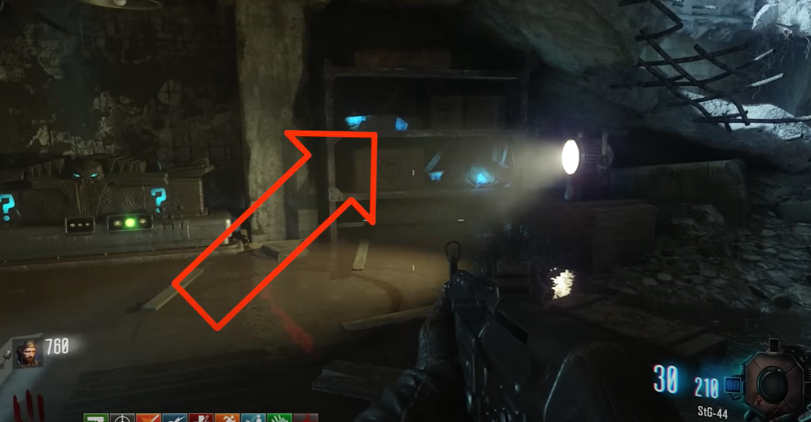
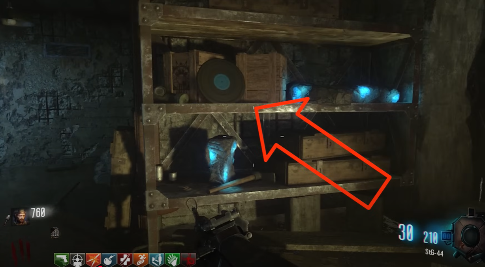
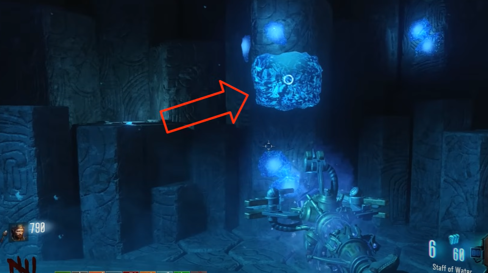
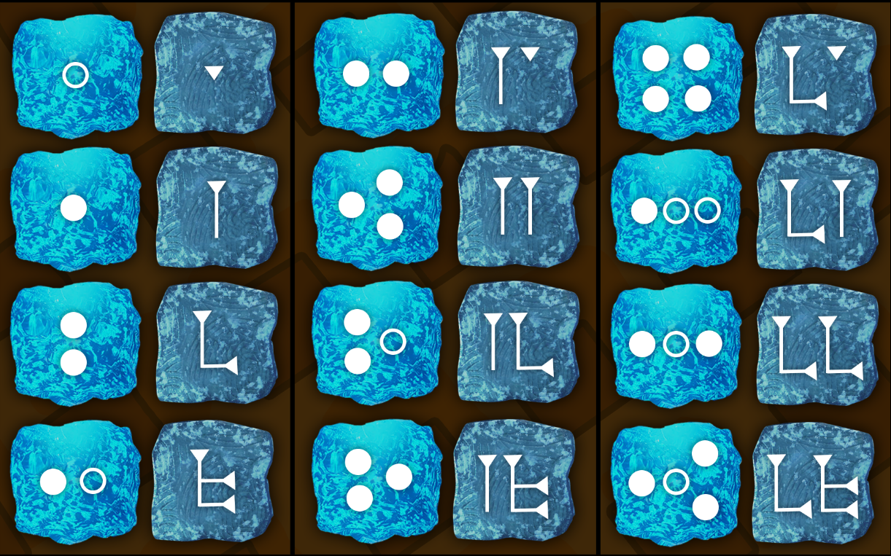
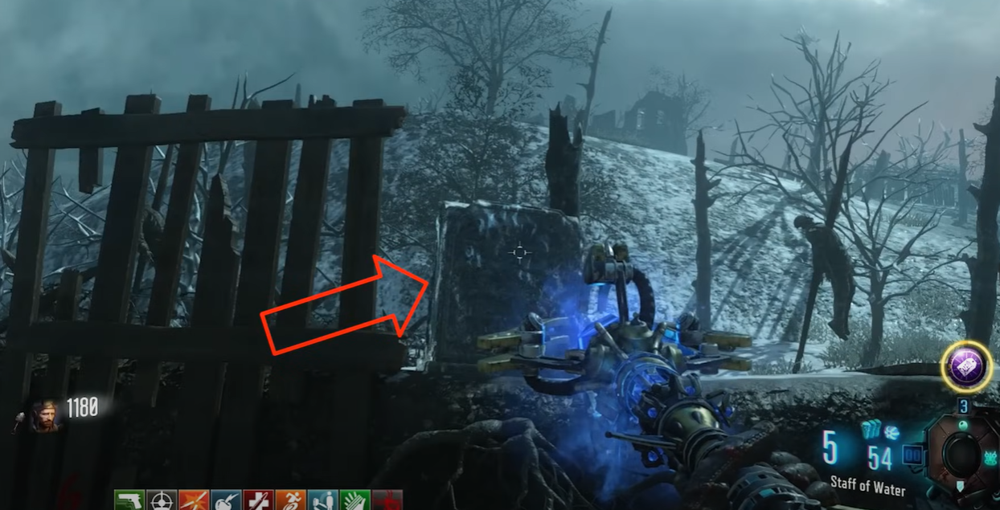
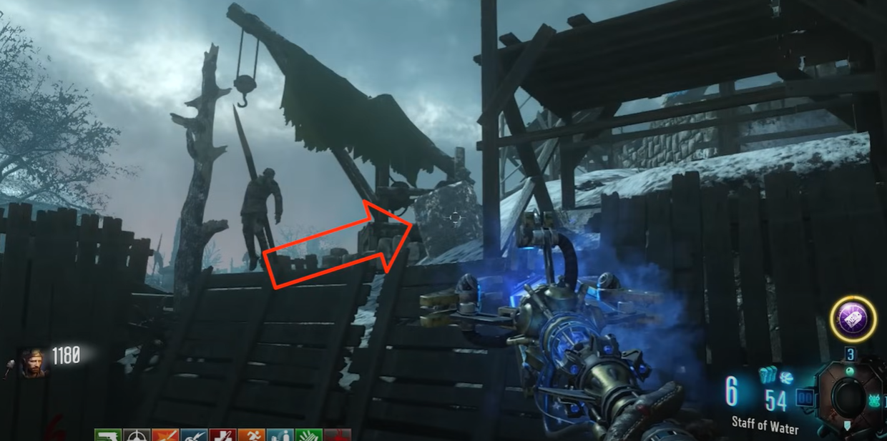
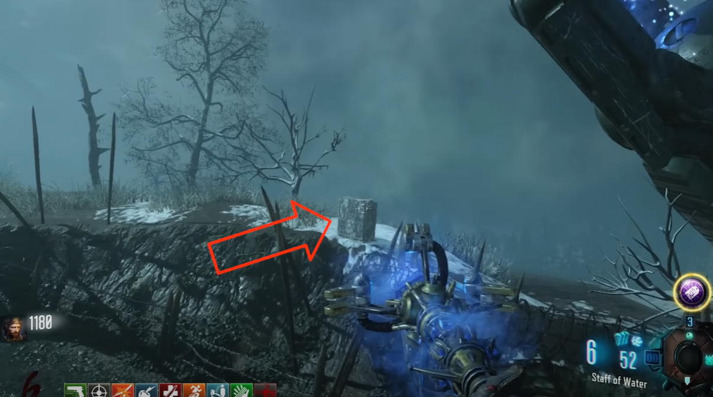
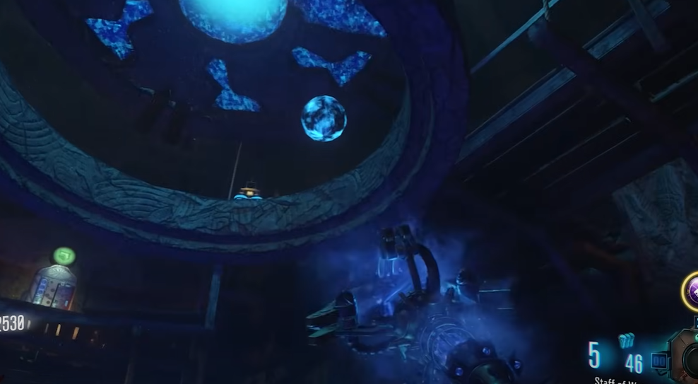

# Ice Staff Build and Upgrade Guide

## Note:
* Need the Gramophone
* Need the black record
* Need a shovel

## Ice Staff build guide
You can craft the Ice Staff at the bottom of the dig site on the blue pedestal.

### Blue record locations:
At the tank station on the table right by the bunker entrance.\
\
\
At the tank station bunker on the shelf next to the mystery box.\
\
\
At the tank station on a shelf near the backside of the bunker.\

### Ice gemstone
In the ice tunnel, by generator 6, place down the gramophone to build the portal to the crazy place. In the crazy place head to the blue pedestal and take the ice gemstone.

### Staff parts
Using a shovel, dig up dig spots around the map while it is snowing. It cannot be raining, MUST be snowing. When doing this you have a chance to dig up an Ice Staff part. All three parts are collected this way.

## Ice Staff upgrade steps

### Step 1:
Go into the crazy place. Leaving the portal directly above it, there will be a row of tiles with symbols on them, there will also be a symbol on the pillar next to the portal.\
\
\
\
The symbol on the pillar tells you which of the symbols floating above need to be shot. Here is a translation for all the symbols on the pillar and their corresponding symbols:\
\
\
\
You will shoot the symbol according to the translation and then a new symbol will appear on the pillar. You will repeat the process of shooting the symbols above depending on the pillar until there are no more symbols. If the incorrect symbol is shot then you must start over.

### Step 2:
Find and freeze three tombstones and destroy them by shooting them with bullets. Shoot it with the ice staff, it will freeze over and then it can be destroyed by shooting it with a gun. Do this for all three tombstones.

#### Tombstone locations:
Behind generator four just outside the robot's footprint.\
\
\
On the side of the dig site, visible from one of the robot's footprints. Nearby generator four.\
\
\
Out on the tank trail behind the tank station heading left.\

### Step 3:
At the bottom of the mound, rotate the four rings in the center of the room so that they are all blue. Use the four levers to rotate them, once they are all blue shoot the blue orb twice with the ice staff.\
\
\
\
It should fly up into the air if done correctly.

#### Lever locations:
The lever on the stairs heading downwards clockwise rotates the top ring.\
\
\
The lever on the stairs heading downwards counter-clockwise rotates the ring below that.\
\
\
The lever on the wooden platform just above Mule Kick to its left rotates the next ring.\
\
\
The lever on the wooden platform just above Mule Kick to its right rotates the last ring.\

### Step 4:
In the crazy place, place the Ice Staff in the blue pedestal. It's the same pedestal that you collected the ice gemstone from. You now must kill around 25 zombies anywhere in the crazy place. You will see their souls leave their bodies. Once you can pick the staff back up it will be upgraded.
