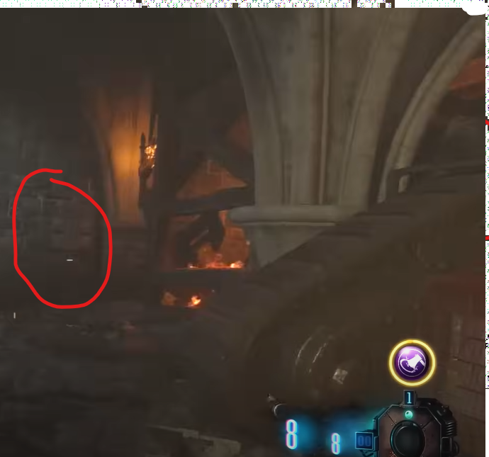

# Lightning Staff Build and Upgrade Guide

## Note:
* Need the Gramophone
* Need the black record

## Lightning Staff build guide
You can craft the Lightning Staff at the bottom of the dig site on the purple pedestal.

### Purple record locations:
On the wooden cart on the tank path in front of generator four.\
\
\
On the table next to the Wunderfizz machine stationed at generator four.\
\
\
At the bottom of the wind tunnel to the right of the portal. The wind tunnel is next to generator four.\

### Lightning gemstone:
Go into the lightning tunnel which is next to generator five. Place down the Gramophone to build the portal and go to the crazy place. The purple pedestal is the one containing the lightning gemstone.

### Staff parts:
Each part for the Lighting Staff can be collected in areas only accessible by jumping to them while the tank is moving. The first part is on the right side after activating the tank from its church location:\
\
\
\
Make sure to jump off the tank and onto the wooden platform as it is driving past the location.\
\
\
\
The next part will be on the left side after the tank has been activated from its tank station location.\
\
\
\
It will be on the wooden ledge connected to the dig site.\
\
\
\
The last part will be near the end of the same tank activation on the right side.\
\
\
\
It will be just before the tank stops at the church.\
\
\
\
Note that it will be easier to bring two players for the second tank ride as the second player can jump to get the last staff part at the church. It is possible to do the second tank run alone in one activation, you must run very quickly to get back to the tank after the first jump to do so.

## Lightning Staff upgrade steps

### Step 1:
In the crazy place, next to the lightning portal, there are some keys akin to a piano.\
\
\
\
There are also some chords next to the keys telling you what notes to play. If you know how to read the chords and can play them, shoot them with the Lightning Staff. If not, use the reference here:\
\
\
\
Only the bottom row of keys need to be played. Make sure to wait for the notes to finish for each chord.

### Step 2:
there will be numerous dials around the map that need to be rotated into the correct position so that they are no longer sparking.\
\
\
\
The position that each dial needs to be in is the same for every match. There will be eight in total. The dial in the workshop can be ignored as it is in its correct position already.\

#### Dial locations:
In the tank station near the back door, rotate it pointing down.\
\
\
In spawn at the bottom of the stairs, rotate it pointing left.\
\
\
At generator four on the robot's footprint next to the wind tunnel entrance, set the dial pointing up.\
\
\
At the church, upstairs next to the box location, rotate pointing up.\
\
\
Below the church, behind the tank location, set the dial pointing right.\
\
\
At generator five in the corner next to the Wunderfizz machine, rotate pointing down.\
\
\
On the path circling the mound near the path to the church, set the dial pointing up.

### Step 3:
At the bottom of the mound, rotate the four rings in the center of the room so that they are all purple. Use the four levers to rotate them, once they are all purple, shoot the purple orb twice with the Lightning Staff.\
\
\
\
It should fly up into the air if done correctly.

#### Lever locations:
The lever on the stairs heading downwards clockwise rotates the top ring.\
\
\
The lever on the stairs heading downwards counter-clockwise rotates the ring below that.\
\
\
The lever on the wooden platform just above Mule Kick to its left rotates the next ring.\
\
\
The lever on the wooden platform just above Mule Kick to its right rotates the last ring.\

### Step 4:
In the crazy place, place the Lightning Staff in the purple pedestal. It's the same pedestal that you collected the lightning gemstone from. You now must kill around 25 zombies anywhere in the crazy place. You will see their souls leave their bodies. Once you can pick the staff back up it will be upgraded.
