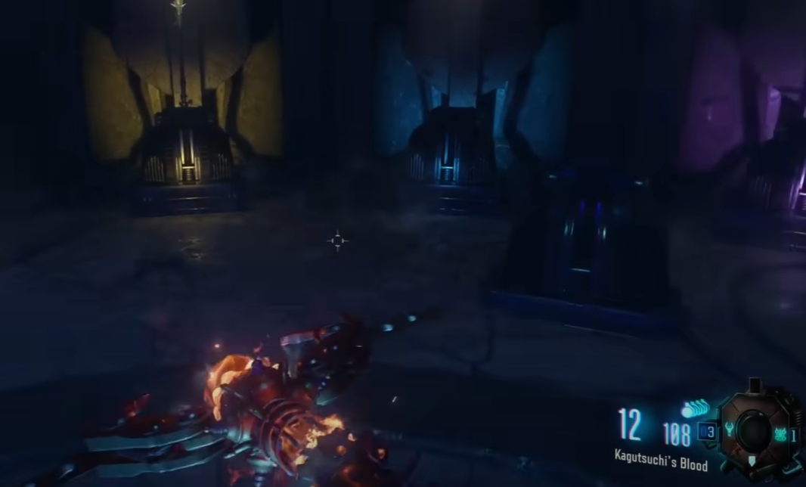
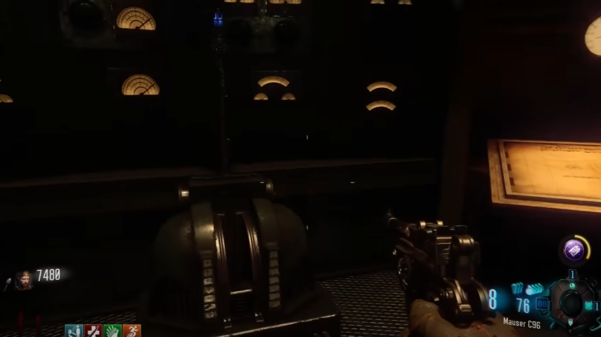
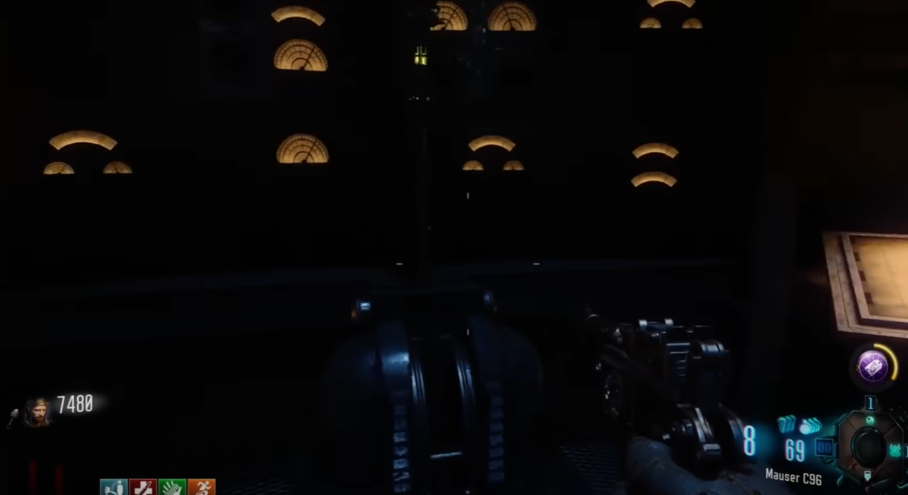
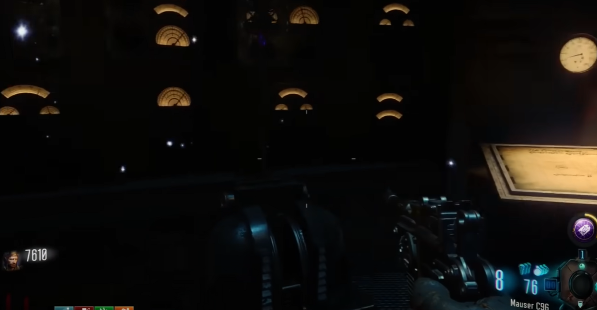
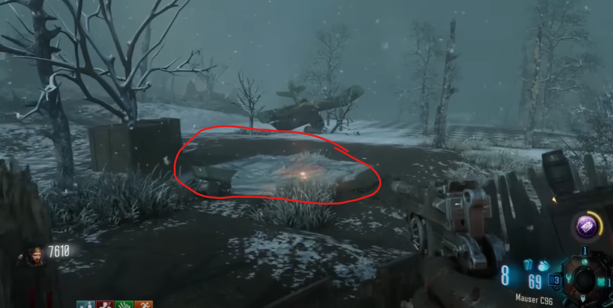
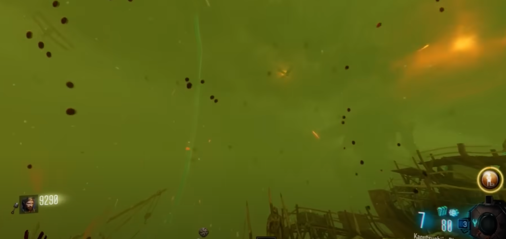
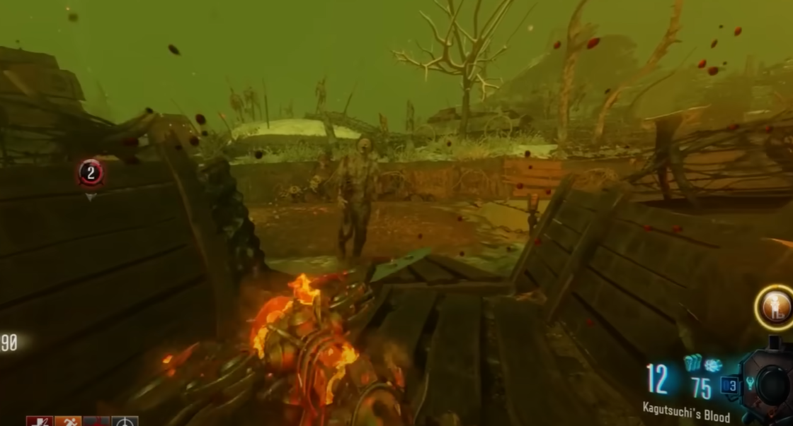
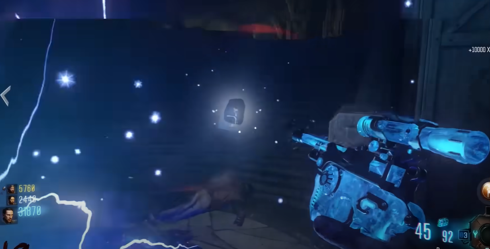

# Origins Main Quest Guide

## Recommended setup:
* Kill Joy
* Dead of Nuclear Winter
* Head Drama
* Shield

## Note:
* Need to build and upgrade all four staffs
* Need the G-Strikes
* Need to build the Maxis drone
* Need the iron fists

## Steps

### Step 1:
Secure the keys, and build all four staffs.

### Step 2:
Ascend from darkness, place all staffs in new staff holders around the map. All generators must be on for this step. They will return to their original holders once all four are in the new holders at the same time. Each staff must be put into a specific holder.

#### Staff holder locations:
The fire staff goes into the holder at the bottom of the excavation site.\
\
\
The ice staff goes into the holder in the church robot head.\
\
\
The wind staff goes into the holder in the middle robot head.\
\
\
The lightning staff goes into the holder in the trench robot head.\

### Step 3:
Rain fire, have a teammate go into a robot head to press the red button inside. Once press throw a G-Strike onto this area outside the map by generator 5:\
\
\
\
All generators must be on for this step to work.

### Step 4:
Unleash the horde, release a Maxis drone near the newly blown hole from step 3. A bunch of Panzers will come out and you must kill them all.

### Step 5:
Skewer the winged beast, go into zombie blood and shoot down a plane similar to the plane you must shoot down for the fire staff part.\
\
\
\
Note that the plane cannot be shot down unless you are in zombie blood. While in zombie blood you must find a zombie that is running clockwise around the excavation site. This one specific zombie must be killed and he will drop a Maxis drone, pick it up.\
\
\
\
If the zombie does not drop the drone then you did not kill the correct zombie.

### Step 6:
Weild a fist of iron, once you have the iron fists you must upgrade them. Go to the bottom of the excavation site. Some zombies will have a white mist, punch them to remove the mist. Eventually, when enough zombies have been punched, a stone tablet will appear.\
\
\
\
Pick it up to complete the step.

### Step 7:
Raise hell, place all four staffs into their holders in the crazy place. You then must get kills in the crazy place. The screen will flash white when complete.

### Step 8:
Freedom, deploy the Maxis drone in the center of the crazy place. It will fly up into the ceiling. Have all players interact in the center of the crazy place at the same time.

### Step 9:
good game brah
