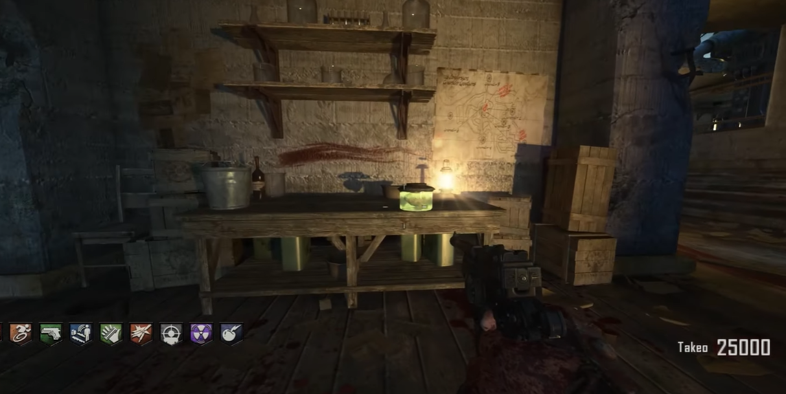
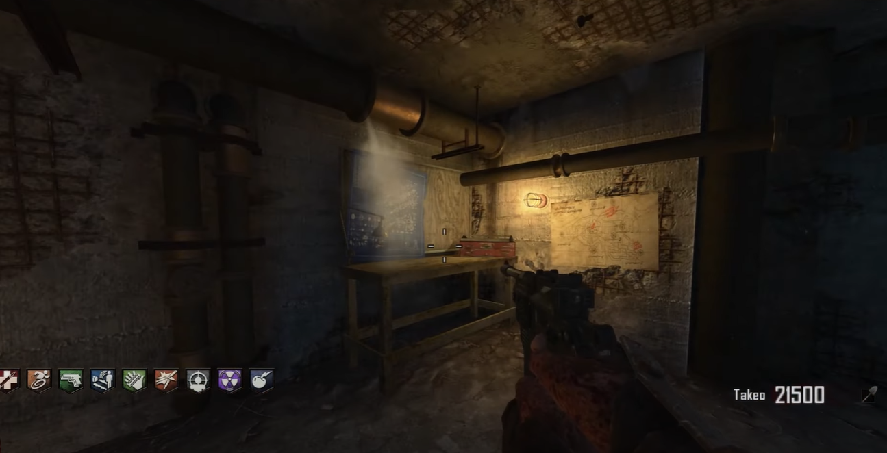
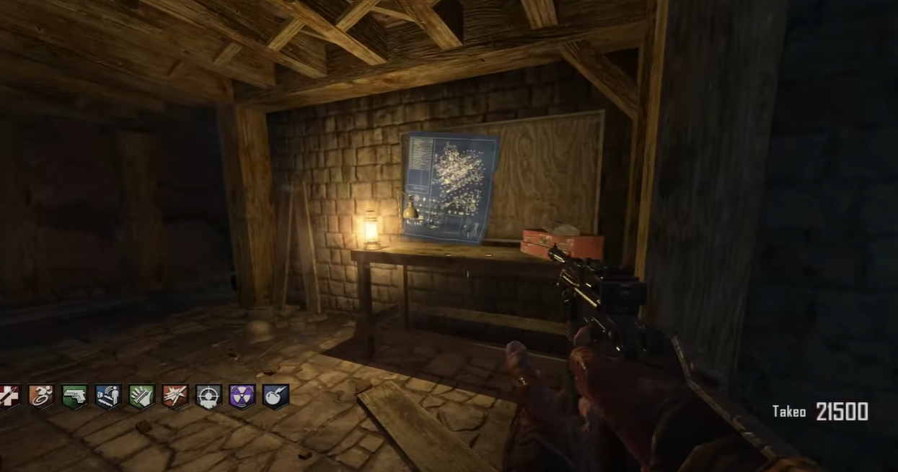
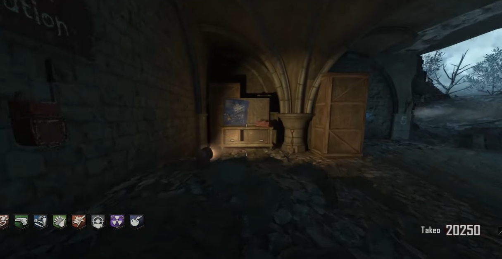
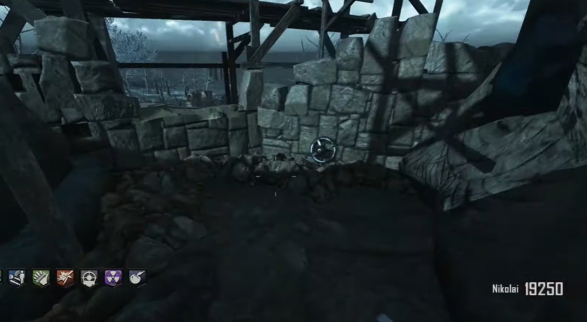
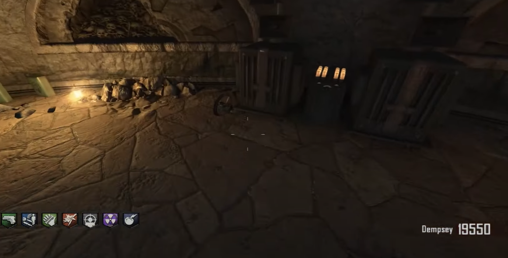
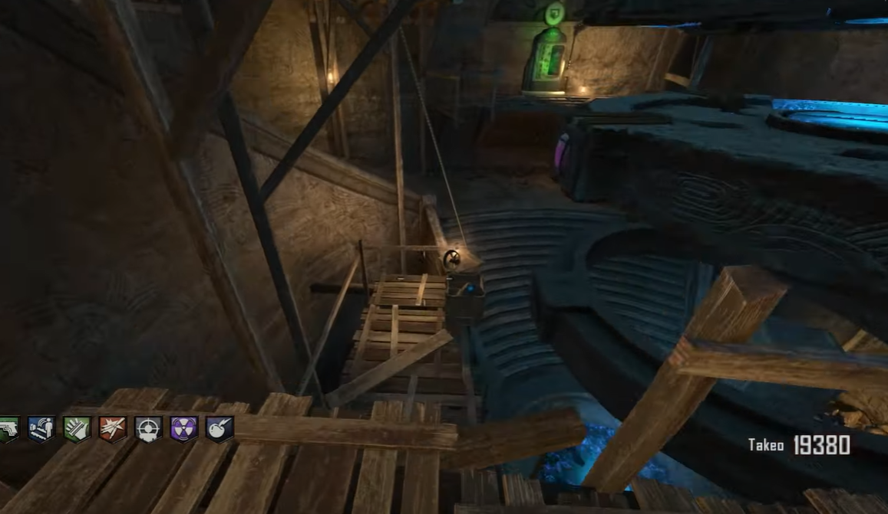
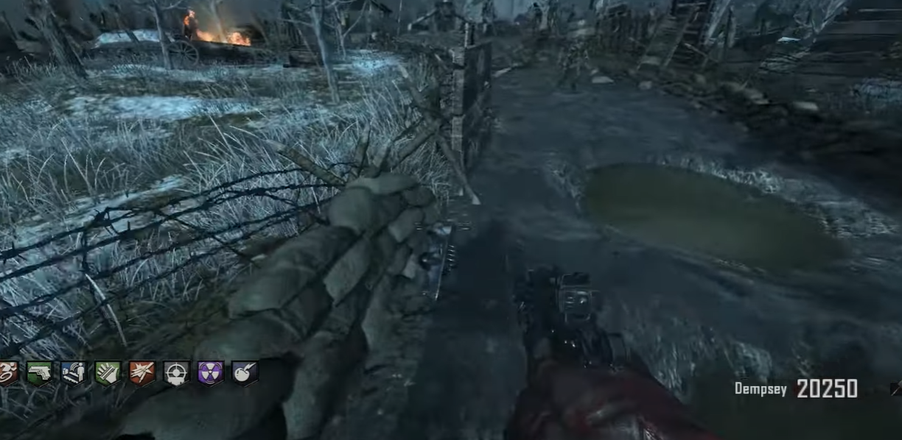
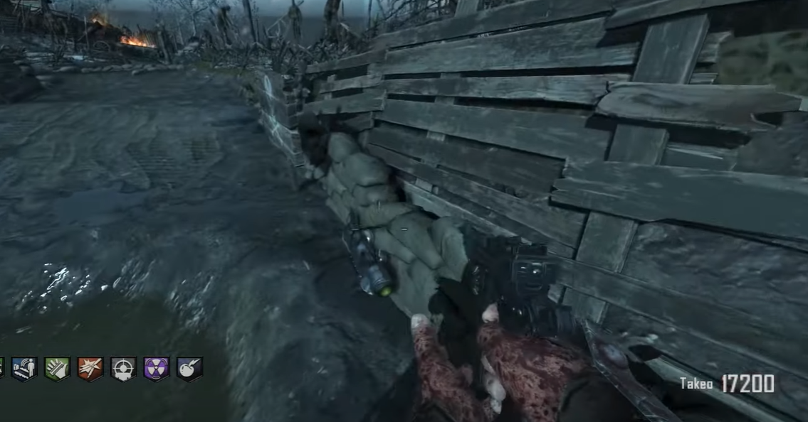
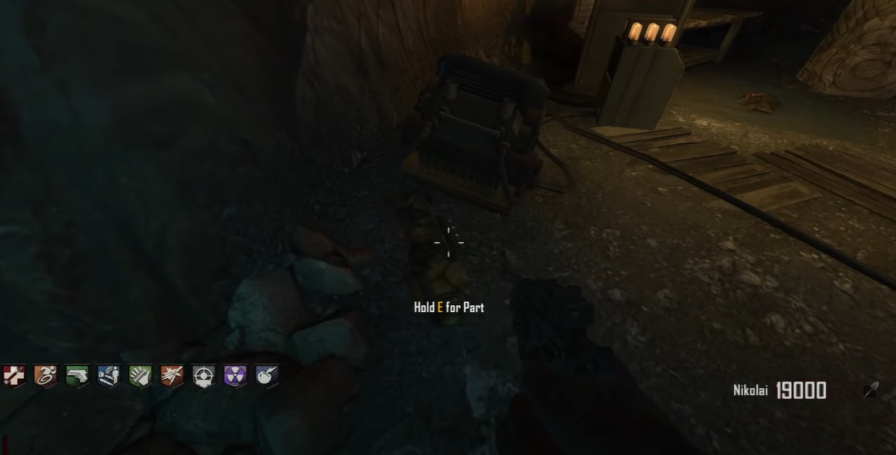

# Maxis Drone Build Guide
The brain is always on the table in the spawn room:\

## Build table locations:
At the bottom of the workshop.\
\
\
Just inside the entrance of the wind tunnel.\
\
\
Below the church, behind the tank location.\

## Rotors locations:
At the top of the digs ite here:\
\
\
Inside the dig site, next to the Gramophone:\
\
\
On the scaffolding inside te dig site.\

## Frame locations:
On the left side of the tank path on the way to generator four from the chruch.\
\
\
On the right side of the tank path on the way to generator five from the chruch.\
\
\
At the bottom of the ice tunnel:\

