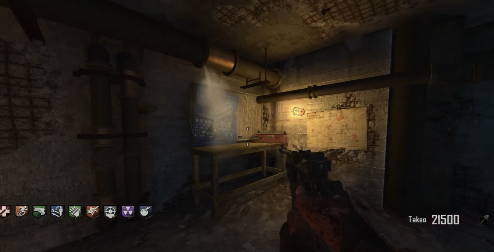
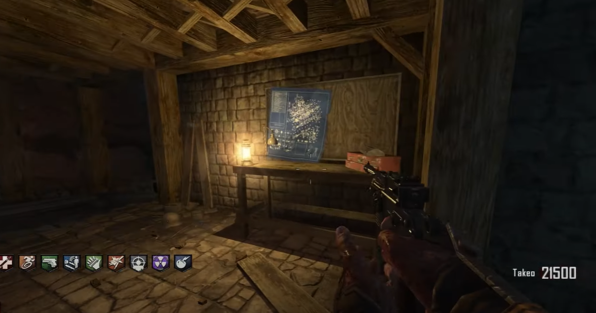
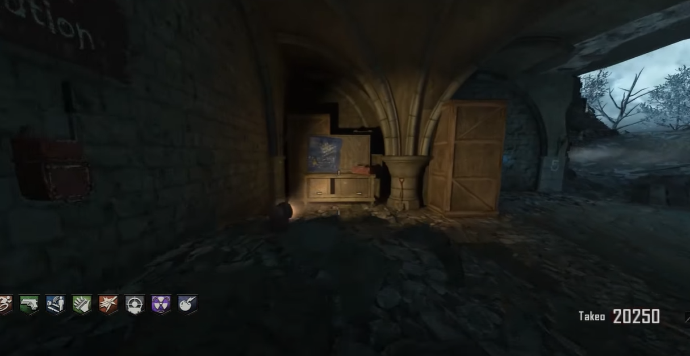

# Origins Shield Build Guide

## Build table locations:
At the bottom of the workshop.\
\
\
Just inside the entrance of the wind tunnel.\
\
\
Below the church, behind the tank location.\

## First part locations:
In the trenches between generators one and two.\
\
\
On the robot's footprint above the tank station.\
\
\
At the end of the tench just past generator two.\

## Second part locations:
In the trenches between generators one and three.\
\
\
At the bottom of the fire tunnel.\
\
\
In between generator three and speed cola.\

## Third part locations:
In the robot's footprint in between the dig site and the soul chest next to generator five.\
\
\
In the robot's footprint in between the dig site and the soul chest next to generator four.\
\
\
In the same robot footprint that has the sould chest next to generator 4.\

