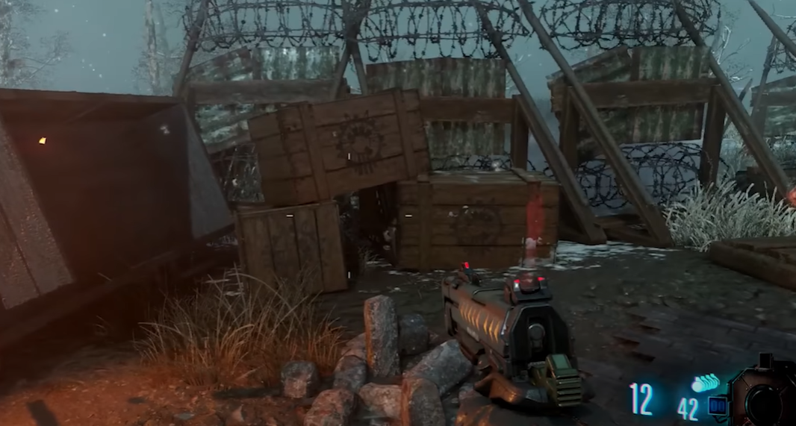

# Wind Staff Build and Upgrade Guide

## Note:
* Need the Gramophone
* Need the black record

## Wind Staff build guide
You can craft the Wind Staff at the bottom of the dig site on the yellow pedestal.

### Yellow record locations:
In the lighting tunnel by generator five on the left side when you enter the tunnel.\
\
\
On this stack of boxes just outside the entrance to the lighting tunnel by generator five:\
\
\
Propped up on the wall right next to Stamin-Up at generator five.\

### Wind gemstone
Go into the wind tunnel which is near generator four. Place down the Gramophone to build the portal to the crazy place. Go into the portal and find the yellow pedestal and pick up the wind gemstone.

### Staff parts
All three staff parts can be found inside the robot heads. One piece is in the robot that walks over the tranches or spawn, in the robot that walks over the central dig site, and in the robot that walks over the church where generator six is. You can go into a robot head by identifying if the underside of one of its feet has a glowing ring on it.\
\
\
\
If it does, shoot it and then stand under where it is about to step to enter inside. Keep in mind that if you do not shoot it, or the foot is not lit up then you will be crushed. Only one foot will be like this every time the robots come through the map. So if all three are coming through then one of the six feet will be available.

## Wind Staff upgrade steps

### Step 1:
In the crazy place, just above the wind portal, there is a large formation of rings that have symbols on them. Shooting each layer of rings with the wind staff will cause that layer to spin. Spin all layers of the ring so that they line up with this inscription:\
\
\
\
The ring must be positioned so that the given symbols are in the green slots. This combination is the same in every match.

### Step 2:
Find and shoot three chimneys with the wind staff so that the smoke coming out of them is directed toward the dig site. You must be facing towards the dig site in order to redirect the smoke in the proper direction.

#### Chimney locations:
Right in between generator four and the wind tunnel.\
\
\
On the tank trail from the church towards generator five on the right side.\
\
\
By generator five, just through the window to the left of Stamin-Up.\

### Step 3:
At the bottom of the mound, rotate the four rings in the center of the room so that they are all yellow. Use the four levers to rotate them, once they are all yellow, shoot the yellow orb twice with the Wind Staff.\
\
\
\
It should fly up into the air if done correctly.

#### Lever locations:
The lever on the stairs heading downwards clockwise rotates the top ring.\
\
\
The lever on the stairs heading downwards counter-clockwise rotates the ring below that.\
\
\
The lever on the wooden platform just above Mule Kick to its left rotates the next ring.\
\
\
The lever on the wooden platform just above Mule Kick to its right rotates the last ring.\

### Step 4:
In the crazy place, place the Wind Staff in the yellow pedestal. It's the same pedestal that you collected the wind gemstone from. You now must kill around 25 zombies anywhere in the crazy place. You will see their souls leave their bodies. Once you can pick the staff back up it will be upgraded.
